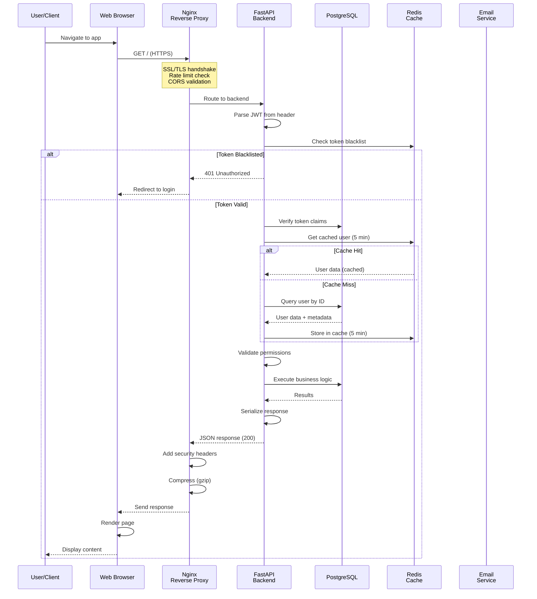
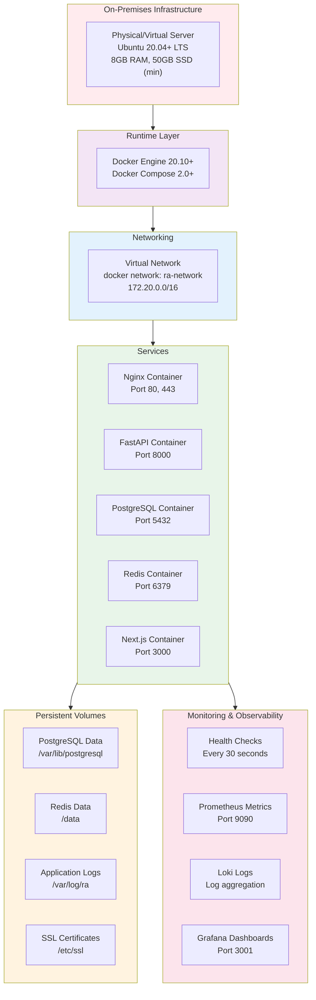
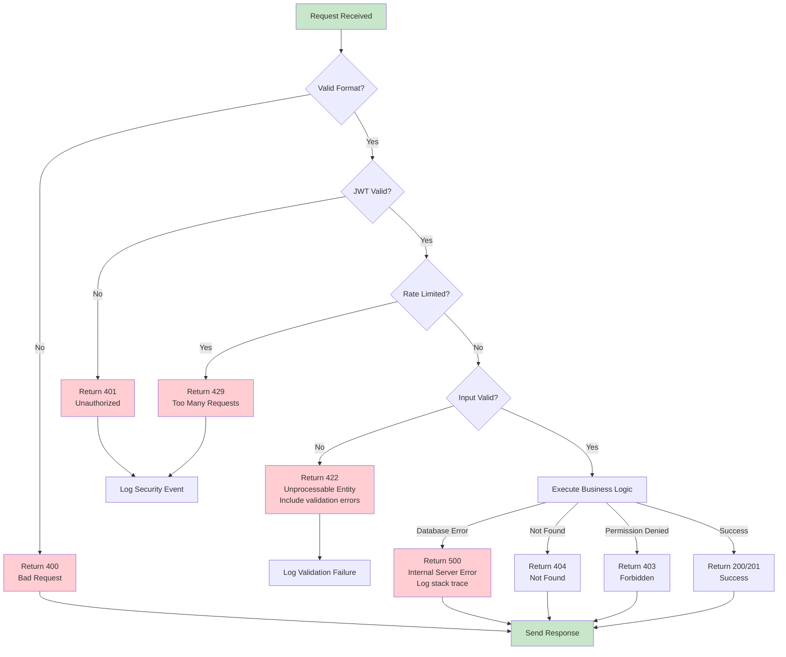
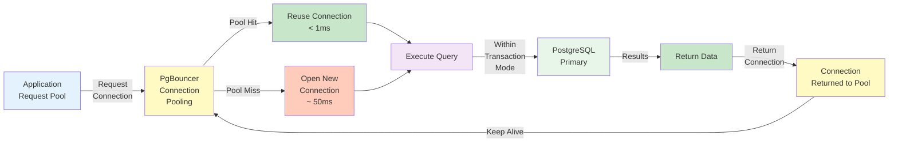
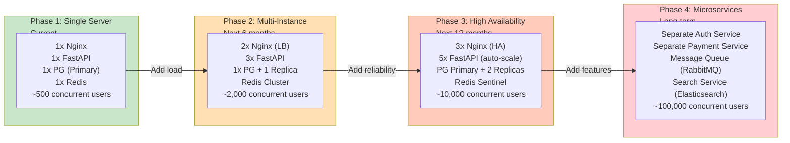

# Architectural Diagrams & Visual References

This document contains supplementary Mermaid diagrams for the RA Community Management System architecture.

## 1. Complete System Request-Response Lifecycle



## 2. Data Flow: System-Wide

```mermaid
graph LR
    subgraph CLIENT["Client Applications"]
        WEB["Next.js<br/>Web Frontend"]
        MOBILE["React Native<br/>Mobile App"]
    end
    
    subgraph NETWORK["Network Layer"]
        direction LR
        HTTPS["HTTPS/TLS<br/>Encrypted"]
    end
    
    subgraph GATEWAY["API Gateway"]
        RATE["Rate Limiting<br/>100 req/min"]
        CORS["CORS<br/>Validation"]
        AUTH["Auth Check"]
    end
    
    subgraph API["API Layer"]
        REST["RESTful Endpoints<br/>CRUD operations"]
        VALIDATE["Input Validation<br/>Pydantic schemas"]
        BUSINESS["Business Logic<br/>Services"]
    end
    
    subgraph CACHE_LAYER["Caching"]
        CACHE["Redis Cache<br/>5-60 min TTL"]
    end
    
    subgraph PERSISTENCE["Data Persistence"]
        DB["PostgreSQL<br/>Primary"]
        AUDIT["Audit Logs<br/>Track changes"]
    end
    
    CLIENT -->|API Requests| HTTPS
    HTTPS -->|Forward| GATEWAY
    
    GATEWAY -->|Validated| AUTH
    AUTH -->|Check| CACHE
    
    CACHE -->|Hit| REST
    CACHE -->|Miss| REST
    
    REST -->|Validate| VALIDATE
    VALIDATE -->|Execute| BUSINESS
    
    BUSINESS -->|Read| CACHE
    BUSINESS -->|Cached| DB
    BUSINESS -->|Write| DB
    BUSINESS -->|Log| AUDIT
    
    DB -->|Cache Response| CACHE
    
    REST -->|Response| GATEWAY
    GATEWAY -->|HTTPS| CLIENT
    
    style CLIENT fill:#e3f2fd
    style NETWORK fill:#fff3e0
    style GATEWAY fill:#f3e5f5
    style API fill:#e8f5e9
    style CACHE_LAYER fill:#fce4ec
    style PERSISTENCE fill:#e0f2f1
```



## 3. Deployment Environment Layers



## 4. Security Zones

```mermaid
graph TB
    subgraph ZONE1["DMZ / Public Zone"]
        INT["Internet<br/>Untrusted"]
        NGINX["Nginx Reverse Proxy<br/>- SSL Termination<br/>- Rate Limiting<br/>- Request Filtering"]
    end
    
    subgraph ZONE2["Application Zone<br/>Internal Network"]
        API["FastAPI Backend<br/>- JWT Validation<br/>- Input Validation<br/>- Business Logic"]
        AUTH["Auth Service<br/>- Token Management"]
    end
    
    subgraph ZONE3["Data Zone<br/>Restricted Access"]
        DB["PostgreSQL<br/>Encrypted Connections<br/>Strong Authentication"]
        CACHE["Redis<br/>Protected Network<br/>Authentication Enabled"]
    end
    
    INT -->|HTTPS| NGINX
    NGINX -->|HTTP (internal)| API
    
    API -->|SQL Statements<br/>Parameterized| DB
    API -->|Cache Operations<br/>Authenticated| CACHE
    
    style ZONE1 fill:#ffcdd2
    style ZONE2 fill:#fff9c4
    style ZONE3 fill:#c8e6c9
```

## 5. Error Handling Flow



## 6. Database Connection Lifecycle



## 7. Scalability Scaling Path



## 8. Token Lifecycle with Rotation

```mermaid
stateDiagram-v2
    [*] --> Generated: Login / OAuth
    
    Generated --> Active: Store securely
    
    Active --> Refreshed: Call /token/refresh
    
    Refreshed --> Active: Issue new access token
    
    Active --> Expired: 24 hours pass
    
    Expired --> ReissueRefresh: Use refresh token
    
    ReissueRefresh --> Active: New access token
    
    Active --> Blacklisted: Logout
    Active --> Blacklisted: Password reset
    Active --> Blacklisted: Account locked
    
    Blacklisted --> Invalid: Checked on every request
    
    Invalid --> Redirect: Return 401
    
    Redirect --> [*]: Redirect to login
    
    note right of Generated
        JWT Claims:
        - sub (user_id)
        - aud (audience)
        - iss (issuer)
        - exp (expiration)
        - iat (issued at)
        - jti (token ID)
    end
    
    note right of Refreshed
        Refresh token rotation:
        - Issue new refresh token
        - Invalidate old token
        - Track in Redis
    end
```

## 9. Complete Deployment Checklist

```mermaid
graph TB
    subgraph PRE_DEPLOY["Pre-Deployment"]
        P1["✓ Prepare server<br/>Ubuntu 20.04+, 8GB RAM"]
        P2["✓ Install Docker & Docker Compose"]
        P3["✓ Prepare SSL certificates<br/>Nginx, domain ready"]
        P4["✓ Configure environment variables<br/>.env file created"]
        P5["✓ Prepare OAuth credentials<br/>Google, Microsoft, Apple"]
    end
    
    subgraph DEPLOY["Deployment"]
        D1["Clone repository"]
        D2["Update .env with secrets"]
        D3["docker-compose build"]
        D4["docker-compose up -d"]
        D5["Run database migrations"]
        D6["Verify health checks"]
    end
    
    subgraph POST_DEPLOY["Post-Deployment"]
        PD1["✓ Verify all services running<br/>docker-compose ps"]
        PD2["✓ Test API endpoints<br/>curl localhost:8000/health"]
        PD3["✓ Test web app<br/>https://domain"]
        PD4["✓ Check logs for errors<br/>docker-compose logs"]
        PD5["✓ Configure monitoring<br/>Prometheus, Grafana"]
        PD6["✓ Set up backups<br/>Daily snapshots"]
        PD7["✓ Document passwords<br/>Secure password manager"]
    end
    
    subgraph ONGOING["Ongoing Operations"]
        O1["Monitor logs daily"]
        O2["Review metrics in Grafana"]
        O3["Update containers monthly"]
        O4["Test backup restoration quarterly"]
        O5["Review security logs weekly"]
    end
    
    P1 --> P2 --> P3 --> P4 --> P5
    P5 --> D1 --> D2 --> D3 --> D4 --> D5 --> D6
    D6 --> PD1 --> PD2 --> PD3 --> PD4 --> PD5 --> PD6 --> PD7
    PD7 --> O1 --> O2 --> O3 --> O4 --> O5
    
    style PRE_DEPLOY fill:#c8e6c9
    style DEPLOY fill:#fff9c4
    style POST_DEPLOY fill:#ffe0b2
    style ONGOING fill:#ffccbc
```



---

## Reference: Common Network Flows

### Successful Authentication Request

```
Client → HTTPS → Nginx (Rate Limit OK) → FastAPI
FastAPI: Validate credentials → Hash check → Generate JWT
FastAPI: Store refresh token in Redis
Client ← HTTPS ← {access_token, refresh_token, expires_in}
Client: Store tokens securely (httpOnly cookie or Keychain)
```

### API Request with Valid Token

```
Client (with access_token) → HTTPS → Nginx
Nginx: Rate limit check → CORS check
Nginx → FastAPI (internal HTTP)
FastAPI: Extract JWT from header
FastAPI: Verify signature, expiration, claims
FastAPI: Check Redis blacklist (MISS = token not revoked)
FastAPI: Load user from cache (Redis) or DB
FastAPI: Execute endpoint logic
FastAPI: Return data (cached) or query DB
Client ← HTTPS ← {data, 200 OK}
```

### Token Refresh Flow

```
Client (with refresh_token) → POST /token/refresh → Nginx
Nginx → FastAPI
FastAPI: Validate refresh token in Redis
FastAPI: Check expiration (7 days)
FastAPI: Generate new access_token (24 hours)
FastAPI: Generate new refresh_token (rotate)
FastAPI: Invalidate old refresh_token in Redis
Client ← {new_access_token, new_refresh_token}
Client: Update stored tokens
```

### Logout Flow

```
Client → DELETE /auth/logout → Nginx
Nginx → FastAPI + Authorization header
FastAPI: Extract token
FastAPI: Add token to Redis blacklist (7 day expiry)
FastAPI: Remove refresh token from Redis
Client ← {200 OK}
Client: Clear local token storage
Next request → 401 Unauthorized → Redirect to login
```

---

**Last Updated:** 2026-06-10  
**Maintainer:** Architecture Team
